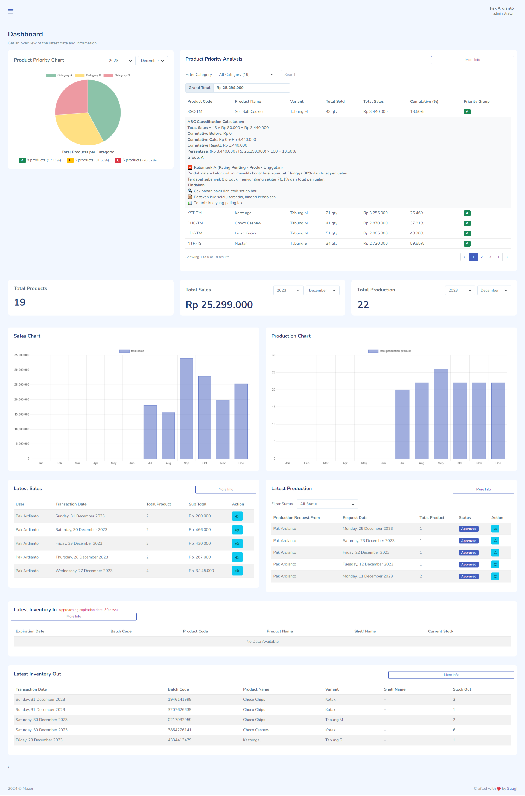

<div align="center">

<h2> Project Name : Agatha Inventory </h2>




</div>

## 💡 Overview

Agatha Inventory is a Laravel-based inventory management app using FEFO to minimize waste and ABC Classification for prioritizing stock. FEFO ensures items with the earliest expiration are used first, while ABC categorizes inventory by value.
Key features include:

## ✨ Features

- **🔐 Authentication & Roles** – Secure login system with role-based access control.
- **📊 Dashboard** – Intuitive dashboard with real-time data visualization.
- **📱 Responsive Design** – Fully adaptive UI for seamless access on any device.
- **🚀 Server-Side Rendering** – Optimized performance with SSR for fast data processing.
- **🔍 Filtering & Sorting** – Advanced filters and sorting for quick data retrieval.
- **📸 Barcode Scanning** – Quick data lookup using barcode scanning for efficiency.
- **📄 PDF Reports** – Generate and export detailed reports in PDF format.

Whether you're a solo developer or part of a large team, FixHub is the perfect tool for tracking and resolving issues with ease.🐞

## 👩‍💻 Tech Stack

- **🐘 PHP 8.4.1** – Latest PHP version for optimal performance and security.
- **🎼 Composer** – Dependency manager for PHP projects.
- **🦾 Laravel 11** – Robust PHP framework for building scalable web applications.
- **⚡ Livewire 3** – Dynamic front-end framework for Laravel without JavaScript.
- **🎨 Bootstrap 5** – Modern, responsive CSS framework for UI design.
- **📊 Mazer** – [Free Bootstrap 5 Admin Dashboard Template](https://zuramai.github.io/mazer/).
- **🐬 MySQL 8.4** – Powerful open-source relational database management system.

## 📦 Getting Started

To get a local copy of this project up and running, follow these steps.

### 🚀 Prerequisites

- **🐘 PHP 8.4.1** – [Download PHP](https://windows.php.net/index.php)
- **🎼 Composer 2.8.3** – [Dependency manager for PHP](https://getcomposer.org/)
- **🖥️ Laragon** – [Portable development environment](https://laragon.org/)
- **🐬 MySQL 8.4.3** – [Relational database system](https://www.mysql.com/)
- **🔥 Apache 2.4.62** – [HTTP server for web applications](https://httpd.apache.org/)
- **🟢 Node.js 22** – [JavaScript runtime for backend and frontend](https://nodejs.org/en)

## 🛠️ Installation

1. **Clone the repository:**

   ```bash
   git clone https://github.com/owyn-dev/agatha-inventory.git
   cd agatha-inventory
   ```

2. **Install dependencies:**

   Using Composer:

   ```bash
   composer install
   ```

3. **Set up environment variables:**

   Create a `.env` file in the root directory:

   ```bash
   cp .env.example .env
   ```

   ```bash
   DB_CONNECTION=mysql
   DB_HOST=127.0.0.1
   DB_PORT=3306
   DB_DATABASE=l11_agatha_inventory
   DB_USERNAME=root
   DB_PASSWORD=
   ```

4. **Create the database**

   Before running the migrations, create a MySQL database named `l11_agatha_inventory`:

   **Using MySQL CLI:**

   ```bash
   mysql -u root -p
   CREATE DATABASE l11_agatha_inventory;
   EXIT;
   ```

   **Or using phpMyAdmin / HeidiSQL:**
   - Open **phpMyAdmin** or **HeidiSQL**.

   - Select the **Create Database** option.

   - Enter the name: `l11_agatha_inventory`.

   - Click **Save**.

5. **Generate a new application key:**

   ```bash
   php artisan key:generate
   ```

6. **Run database migrations:**

   Run the database migrations and seeders (Set the database connection in .env before migrating):

   ```bash
   php artisan migrate --seed
   ```

7. **Run symbolic link storage:**

   The php artisan storage:link command creates a symbolic link from the public/storage directory to the storage/app/public directory, allowing files stored in storage/app/public to be publicly accessible via the web.

   ```bash
   php artisan storage:link
   ```

8. **Optimize the application cache:**

   For better performance and to refresh cached configuration, routes, and views:

   ```bash
   php artisan optimize
   ```

9. **✔ Running the Website**

   ```bash
   php artisan serve
   ```

   > Open [http://127.0.0.1:8000](http://127.0.0.1:8000) to view the app in your browser.


## 🔐 Default User Accounts & Roles

Below are the default user accounts along with their roles. All users have **"password"** as their initial password.

| Full Name      | Username       | Role         | Description |
|---------------|---------------|-------------|-------------|
| **Administrator** | `administrator` | `administrator` | Full access to all system features and settings. |
| **Production** | `production` | `production` | Manages and oversees production-related tasks. |
| **Sales** | `sales` | `sales` | Handles sales operations, orders, and customer interactions. |
| **Inventory** | `inventory` | `inventory` | Manages stock, inventory tracking, and warehouse operations. |
| **Testing** | `testing` | `testing` | Used for testing and system evaluation purposes. |

### 🔑 Login Information
- **Username:** As listed in the table above.
- **Password:** `password` (Change it after the first login for security reasons).

Make sure to update the passwords and user roles based on your organizational needs. 🚀

## 🤝 Contributing

We welcome contributions to this project. Please follow these steps to contribute:

1. **Fork the repository.**
2. **Create a new branch** (`git checkout -b feature/your-feature-name`).
3. **Make your changes** and commit them (`git commit -m 'Add some feature'`).
4. **Push to the branch** (`git push origin feature/your-feature-name`).
5. **Open a pull request**.

Please make sure to update tests as appropriate.

## 🐛 Issues

If you encounter any issues while using or setting up the project, please check the [Issues]() section to see if it has already been reported. If not, feel free to open a new issue detailing the problem.

When reporting an issue, please include:

- A clear and descriptive title.
- A detailed description of the problem.
- Steps to reproduce the issue.
- Any relevant logs or screenshots.
- The environment in which the issue occurs (OS, browser, Node.js version, etc.).

## 📜 License

Distributed under the MIT License. See [License](/LICENSE) for more information.
